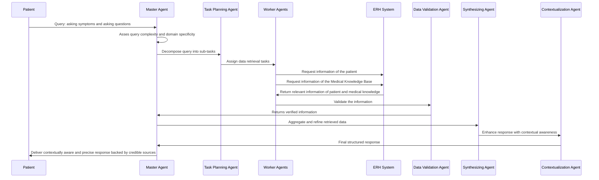

```mermaid
sequenceDiagram
    
    Patient->>Master Agent: Query: asking symptoms and asking questions
    Master Agent->>Master Agent: Asses query complexity and domain specificity
    Master Agent->>Task Planning Agent: Decompose query into sub-tasks
    Task Planning Agent->>Worker Agents: Assign data retrieval tasks
    Worker Agents->>ERH System: Request information of the patient
    Worker Agents->>ERH System: Request information of the Medical Knowledge Base
    ERH System->>Worker Agents: Return relevant information of patient and medical knowledge
    Worker Agents->>Data Validation Agent: Validate the information
    Data Validation Agent->>Master Agent: Returns verified information
    Master Agent->>Synthesizing Agent: Aggregate and refine retrieved data
    Synthesizing Agent->>Contextualization Agent: Enhance response with contextual awareness
    Contextualization Agent->>Master Agent: Final structured response
    Master Agent->>Patient: Deliver contextually aware and precise response backed by credible sources
```
